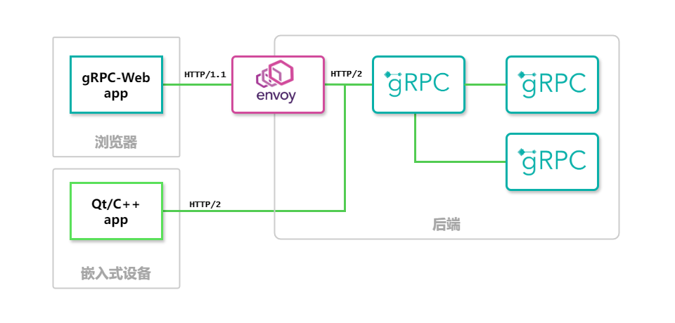
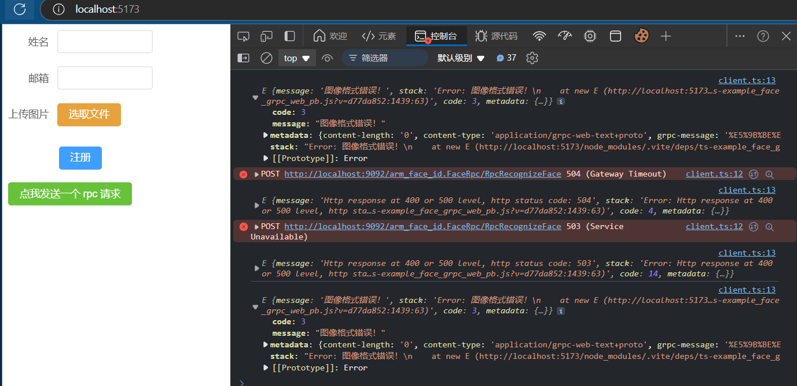

# ArmFaceID-Project 开发计划

该工程计划由以下项目组成，期望实现一个完整的人脸身份识别系统：

- `ArmFaceID-client`: 运行在 `RK-3566` 开发板上的人脸身份识别应用。
- `ArmFaceID-webapp`: 运行在浏览器上的人脸身份注册和管理的`Web`应用。
- `ArmFaceID-server`: 使用 `gRPC` 通信，提供人脸身份服务的后端服务应用。

功能结构图如下所示：

- 浏览器客户端 *间接* 对后端服务进行`gRPC`调用，完成人脸身份的注册。
- Envoy 将 `gRPC-web` 客户端产生的`HTTP/1.1`调用转换为可以由`gRPC`服务处理的`HTTP/2`调用。
- gRPC 服务端根据业务要求处理请求。
- 嵌入式客户端直接调用后端服务处理人脸识别任务。

## ArmFaceID-client

开发中

## ArmFaceID-server

## ArmFaceID-webapp

