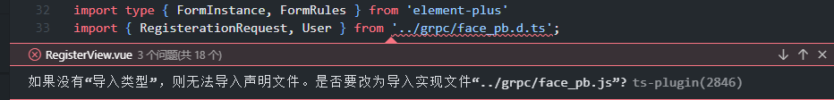

# 如何快速搭建单页面应用

## 新建一个 vue3 工程

```bash
cd your_workspace
npm init vue@latest # 新建一个 vue 应用
npm install # 安装依赖包
npm run dev # 在开发环境下启动应用
npm run format # 代码格式化
npm install @grpc/grpc-js @grpc/proto-loader
```

## `npm install` 卡在 `still idealTree buildDeps`

```bash
npm cache clear --force
# 使用淘宝镜像
npm config set registry https://registry.npmmirror.com
```

<https://www.cnblogs.com/craigtao/p/10179583.html>
<https://github.com/improbable-eng/ts-protoc-gen>

忽视报错即可


## 实现

- 填写表单并上传图片
- 验证表单数据，使用 Base64 编码图片
- 发送 RPC 请求
