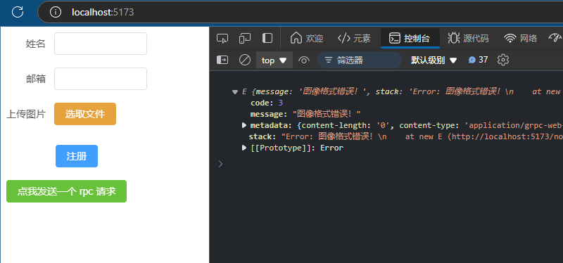

官方 example 使用的 proto 命令与仓库 Readme 有所不同：

```bash
--js_out=import_style=commonjs:./ts-example
--grpc-web_out=import_style=commonjs+dts,mode=grpcwebtext:./ts-example
```

替换到自己的仓库试试：

```bash
protoc -I=./faceid-grpc face.proto \
--js_out=import_style=commonjs:./ts-example \
--grpc-web_out=import_style=commonjs+dts,mode=grpcwebtext:./ts-example
```

直接在 RegisterView.vue 中导入，报错

```
Uncaught SyntaxError: The requested module '/ts-example/face_grpc_web_pb.js' does not provide an export named 'FaceRpcClient' (at RegisterView.vue:41:10)

Refused to load the script 'chrome-extension://1d6ba498-ff41-4db1-8936-7c5114f9426a/assets/src/js/service/content_script_vite-b524463a.js' because it violates the following Content Security Policy directive: "script-src 'self' 'wasm-unsafe-eval' 'inline-speculation-rules'". Note that 'script-src-elem' was not explicitly set, so 'script-src' is used as a fallback.


content_script_vite.js:1  Uncaught (in promise) TypeError: Failed to fetch dynamically imported module: chrome-extension://1d6ba498-ff41-4db1-8936-7c5114f9426a/assets/src/js/service/content_script_vite-b524463a.js
```

官方在 client.ts 中导入使用，再使用 tsc 将 .ts 编译为 .js 嵌入到 .html 中再使用 webpack 打包；而 vue 使用 vite 打包，可能不支持在 .vue 的 `<script>` 中导入 `d.ts/.js`？

仿照官方做法，另起一个 client.ts, npm install 后当作依赖导入工程后：

``` js
var jspb = require('ts-example/node_modules/google-protobuf');
// ✘ [ERROR] Could not resolve "./node_modules/@types/google-protobuf"

//     node_modules/ts-example/face_pb.js:14:19:
//       14 │ var jspb = require('./node_modules/@types/google-protobuf');
//          ╵                    ~~~~~~~~~~~~~~~~~~~~~~~~~~~~~~~~~~~~~~~

// 10:26:28 [vite] error while updating dependencies:
// Error: Build failed with 1 error:
// node_modules/ts-example/face_pb.js:14:19: ERROR: Could not resolve "./node_modules/@types/google-protobuf"
```

参考之前使用 proto 生成的 js，修改这句 js:

```js
var jspb = require('google-protobuf');
```

回到网页测试：

```js
 {message: 'Http response at 400 or 500 level, http status code: 0', stack: 'Error: Http response at 400 or 500 level, http sta…s-example_face_grpc_web_pb.js?v=d77da852:1439:63)', code: 2, metadata: {…}}

POST http://192.168.3.18:9092/arm_face_id.FaceRpc/RpcRecognizeFace net::ERR_CONNECTION_REFUSED client.ts:12 
```

看起来到了下一个问题

代理配置成功!


